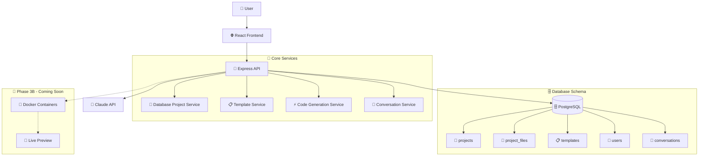
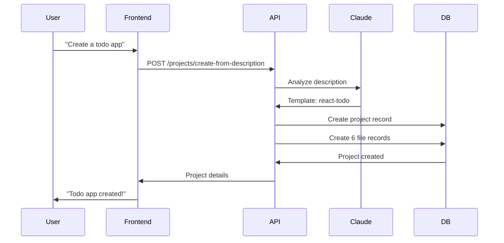
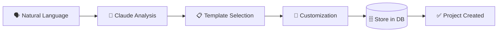
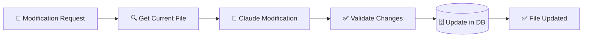
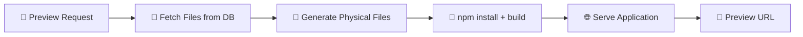
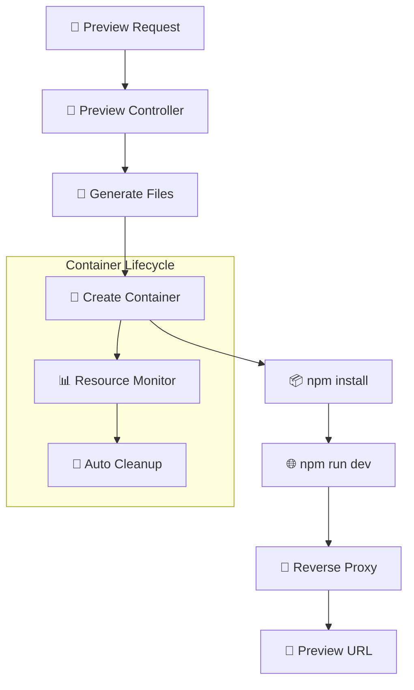

# AI App Platform Architecture

## 🚀 Database-First Voice/Text-to-App Platform Architecture

This document describes the revolutionary architecture of the AI App Platform - a **database-first, voice/text-to-app creation system** that transforms natural language descriptions into complete applications.

---

## 🎯 System Overview

### **Platform Capabilities**
- 🗣️ **Voice/Text-to-App Creation**: Natural language → Complete applications
- 🗄️ **Database-First Storage**: Enterprise-grade project management
- 🔄 **Real-time Code Generation**: Claude-powered file creation/modification
- 🌐 **Multi-User Ready**: Scalable architecture for teams
- 📱 **Live Preview System**: On-demand application preview (Phase 3B)

### **Architecture Comparison**
| **Traditional File System** | **Our Database-First Approach** |
|------------------------------|----------------------------------|
| ❌ Files scattered locally | ✅ Centralized PostgreSQL storage |
| ❌ Single-user limitation | ✅ Multi-user ready |
| ❌ Platform-dependent | ✅ Platform-independent |
| ❌ Complex backup/sync | ✅ Database backup handles all |
| ❌ Limited search | ✅ Full-text search capabilities |

---

## 🏗️ High-Level Architecture



---

## 🗄️ Database-First Storage Layer

### **PostgreSQL Schema Design**

#### **Projects Table**
```sql
CREATE TABLE projects (
  id            TEXT PRIMARY KEY,
  name          TEXT NOT NULL,
  description   TEXT,
  type          ProjectType DEFAULT 'REACT',
  template_id   TEXT,
  user_id       TEXT NOT NULL,
  status        ProjectStatus DEFAULT 'DRAFT',
  metadata      JSONB,
  preview_url   TEXT,
  created_at    TIMESTAMP DEFAULT NOW(),
  updated_at    TIMESTAMP DEFAULT NOW()
);
```

#### **Virtual File System**
```sql
CREATE TABLE project_files (
  id          TEXT PRIMARY KEY,
  project_id  TEXT NOT NULL,
  path        TEXT NOT NULL,
  content     TEXT NOT NULL,
  type        FileType DEFAULT 'CODE',
  size        INTEGER,
  created_at  TIMESTAMP DEFAULT NOW(),
  updated_at  TIMESTAMP DEFAULT NOW(),
  
  UNIQUE(project_id, path)
);
```

#### **Template Management**
```sql
CREATE TABLE templates (
  id          TEXT PRIMARY KEY,
  name        TEXT NOT NULL,
  description TEXT NOT NULL,
  type        ProjectType NOT NULL,
  category    TEXT,
  version     TEXT DEFAULT '1.0.0',
  is_public   BOOLEAN DEFAULT true,
  metadata    JSONB
);
```

### **Database Benefits**
- 🔍 **Full-Text Search**: Search through all project code instantly
- 🔄 **Version Control Ready**: Built-in change tracking
- 👥 **Multi-User Support**: User-scoped project isolation
- 📊 **Analytics Ready**: Project statistics and usage tracking
- 🛡️ **Backup Included**: Database backups cover everything

---

## 🎯 Service Architecture

### **1. Database Project Service**
**`DatabaseProjectService`** - Core project management with virtual file system

```typescript
class DatabaseProjectService {
  // Create project with files in database
  async createProject(request: CreateProjectRequest): Promise<DatabaseProject>
  
  // Virtual file system operations
  async updateFile(projectId: string, filePath: string, content: string)
  async addFile(projectId: string, filePath: string, content: string)
  
  // On-demand file generation
  async generateProjectFiles(projectId: string, outputDir: string)
  
  // Project lifecycle
  async getProject(projectId: string): Promise<DatabaseProject>
  async listUserProjects(userId: string): Promise<DatabaseProject[]>
}
```

**Key Features:**
- 🗄️ **Database Storage**: All files stored as text in PostgreSQL
- 📁 **Virtual File System**: No physical files until preview/export
- ⚡ **On-Demand Generation**: Create physical files only when needed
- 👤 **User Isolation**: Multi-user project scoping

### **2. Template Service**
**`TemplateService`** - Pre-built application scaffolding

```typescript
class TemplateService {
  private templates: Map<string, ProjectTemplate> = new Map();
  
  getTemplates(): ProjectTemplate[]
  getTemplate(id: string): ProjectTemplate | undefined
  getTemplatesByType(type: string): ProjectTemplate[]
}
```

**Available Templates:**
- 🚀 **React Todo App**: Complete todo application with TypeScript
- 🎨 **React Landing Page**: Professional landing page template
- 📊 **Dashboard Template**: (Coming soon)
- 📝 **Blog Template**: (Coming soon)

### **3. Code Generation Service**
**`CodeGenerationService`** - Claude-powered intelligent code creation

```typescript
class CodeGenerationService {
  // Analyze user description and select template
  async analyzeAppDescription(request: AppGenerationRequest): Promise<AppGenerationResult>
  
  // Generate specific components
  async generateComponent(name: string, description: string): Promise<string>
  
  // Modify existing code
  async modifyCode(currentCode: string, instruction: string): Promise<string>
  
  // Generate styles
  async generateStyles(description: string, componentName: string): Promise<string>
}
```

**AI-Powered Features:**
- 🧠 **Template Analysis**: Claude selects best template for description
- ⚡ **Code Generation**: Create new components from natural language
- 🔄 **Code Modification**: Update existing files with instructions
- 🎨 **Style Generation**: Generate CSS/SCSS from descriptions

### **4. Conversation Service**
**`ConversationService`** - Chat context and message management

```typescript
class ConversationService {
  async createConversation(data: CreateConversationData): Promise<Conversation>
  async addMessage(conversationId: string, message: CreateMessageData): Promise<Message>
  async getConversationWithMessages(id: string): Promise<ConversationWithMessages>
  async getUserConversations(userId: string): Promise<Conversation[]>
}
```

---

## 🌐 API Layer Architecture

### **Database-First Controllers**

#### **DatabaseProjectController**
- 🚀 **`POST /api/projects/create-from-description`**: Natural language → Database project
- 📁 **`GET /api/projects`**: List user projects from database
- 📄 **`GET /api/projects/:id`**: Get project + files from database
- ✏️ **`PUT /api/projects/:id/files`**: Update file with Claude
- ➕ **`POST /api/projects/:id/files`**: Add new file with Claude
- 👀 **`POST /api/projects/:id/preview`**: Generate preview files

#### **Request Flow Example**


---

## 🔄 Data Flow Architecture

### **1. Voice/Text-to-App Creation Flow**



**Steps:**
1. **Input Processing**: User provides natural language description
2. **Claude Analysis**: AI determines best template and customizations
3. **Template Application**: Selected template files are customized
4. **Database Storage**: Project and all files stored in PostgreSQL
5. **Response**: User receives project details and file count

### **2. File Modification Flow**



### **3. Preview Generation Flow**



---

## 🚀 Frontend Architecture

### **React Application Structure**

```
src/
├── 📁 components/
│   ├── Chat.tsx              # Main chat interface
│   ├── ChatMessage.tsx       # Individual message component
│   ├── ChatInput.tsx         # Message input with voice support
│   └── ui/                   # Reusable UI components
│       ├── Button.tsx
│       └── Input.tsx
├── 📁 stores/
│   └── chatStore.ts          # Zustand state management
├── 📁 services/
│   └── api.ts                # Axios API client
└── 📁 types/
    └── index.ts              # TypeScript definitions
```

### **State Management with Zustand**

```typescript
interface ChatStore {
  conversations: Conversation[];
  currentConversation: Conversation | null;
  messages: Message[];
  isLoading: boolean;
  
  // Actions
  createConversation: (title: string) => Promise<void>;
  sendMessage: (content: string) => Promise<void>;
  streamMessage: (content: string) => Promise<void>;
}
```

### **API Integration**

```typescript
class ApiService {
  // Chat endpoints
  async sendMessage(data: SendMessageRequest): Promise<Message>
  async streamMessage(data: StreamMessageRequest): Promise<EventSource>
  
  // Project endpoints - NEW DATABASE-FIRST
  async createProjectFromDescription(data: CreateProjectRequest): Promise<Project>
  async listProjects(userId: string): Promise<Project[]>
  async getProject(projectId: string): Promise<ProjectWithFiles>
  async updateProjectFile(projectId: string, data: UpdateFileRequest): Promise<File>
}
```

---

## 🐳 Phase 3B: Live Preview Architecture (Coming Soon)

### **Docker Container Management**



### **Preview Service Architecture**

```typescript
class PreviewService {
  // Container management
  async createPreviewContainer(projectId: string): Promise<ContainerInfo>
  async startPreview(projectId: string): Promise<string>
  async stopPreview(projectId: string): Promise<void>
  
  // File synchronization
  async syncFilesToContainer(projectId: string, containerId: string): Promise<void>
  async watchFileChanges(projectId: string): Promise<void>
  
  // Resource management
  async monitorResources(containerId: string): Promise<ResourceStats>
  async cleanupExpiredPreviews(): Promise<void>
}
```

### **Security & Isolation**
- 🔒 **Sandboxed Execution**: Each preview runs in isolated Docker container
- 📊 **Resource Limits**: CPU and memory constraints per container
- ⏰ **Auto-Cleanup**: Automatic removal of expired previews
- 🌐 **Reverse Proxy**: Secure routing to preview applications

---

## 🔮 Future Enhancements

### **Phase 4: Voice-Driven Development**
- 🗣️ **Speech-to-Text**: Web Speech API integration
- 🎙️ **Voice Commands**: "Make the button blue", "Add a login form"
- 💬 **Conversational Development**: Multi-turn voice interactions
- 🔊 **Voice Feedback**: Spoken status updates and confirmations

### **Advanced Features**
- 🤝 **Team Collaboration**: Real-time multi-user editing
- 🚀 **Deployment Pipeline**: One-click production deployment
- 📊 **Analytics Dashboard**: Usage monitoring and insights
- 🔌 **Plugin Ecosystem**: Extensible AI capabilities
- 🌍 **Multi-Model Support**: GPT-4, Claude, local LLMs

---

## 🛡️ Security Architecture

### **Data Security**
- 🔐 **Environment Variables**: Secure API key management
- 🗄️ **Database Encryption**: PostgreSQL encryption at rest
- 🌐 **HTTPS Only**: Secure data transmission
- 👤 **User Isolation**: Project-level access control

### **Code Execution Security**
- 🐳 **Container Isolation**: Sandboxed execution environments
- 📊 **Resource Limits**: Prevent resource exhaustion
- 🧹 **Auto-Cleanup**: Automatic removal of temporary files
- 🔍 **Input Validation**: Sanitized user inputs

---

## 📊 Performance Optimization

### **Database Performance**
- 📈 **Indexes**: Optimized queries on user_id, project_id
- 🔍 **Full-Text Search**: Efficient code search capabilities
- 📊 **Connection Pooling**: Prisma connection management
- 🗄️ **Query Optimization**: Efficient joins and aggregations

### **API Performance**
- ⚡ **Lazy Loading**: Load files on demand
- 📦 **Response Caching**: Cache template and project metadata
- 🔄 **Streaming**: Real-time Claude responses
- 📊 **Rate Limiting**: Prevent API abuse

---

## 🎯 Deployment Architecture

### **Development Environment**
```
localhost:3000  -> React Frontend (Vite)
localhost:3001  -> Express API
localhost:5432  -> PostgreSQL (Docker)
```

### **Production Ready**
```
Frontend  -> Vercel/Netlify
Backend   -> Railway/Heroku/AWS
Database  -> PostgreSQL (Managed)
Files     -> Database (No separate file storage needed!)
```

### **Scaling Considerations**
- 🌐 **Horizontal Scaling**: Multiple API instances
- 🗄️ **Database Sharding**: User-based partitioning
- 🐳 **Container Orchestration**: Kubernetes for preview containers
- 📊 **Load Balancing**: Distribute preview workloads

---

This database-first architecture provides **enterprise-grade scalability** while maintaining the **simplicity and power** of voice/text-to-app creation. The system is now ready for **Phase 3B: Live Preview System** implementation!